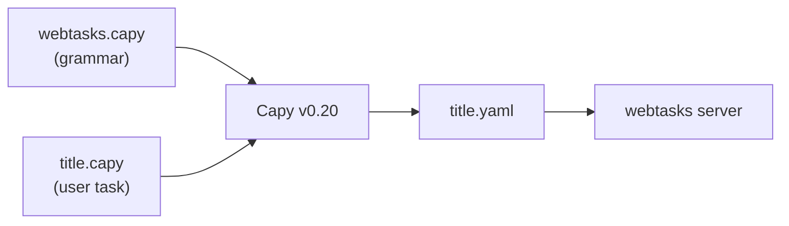

# 2. Capy primer

This chapter summarizes [Capy v0.20.0](https://github.com/olivierdevelops/capy)
concepts for webtasks authors. For the full v0.20 integration reference see
[chapter 0](00-v020-overview.md). Upstream:
[library authoring](https://github.com/olivierdevelops/capy/blob/main/docs/library-authoring.md),
[inner DSL](https://github.com/olivierdevelops/capy/blob/main/docs/inner-dsl.md),
[types](https://github.com/olivierdevelops/capy/blob/main/docs/types.md).

---

## Mental model



Three artifacts:

1. **Library** (`capy/webtasks.capy`) — the entire grammar + renderer.
2. **Source script** (`tasks/basics/title.capy`) — one task per file.
3. **Output** — YAML `TaskDef` (Phase 1); optionally multiple files via `RunMulti`.

Capy has **zero built-in user keywords**. `task`, `goto`, `extract` are all
library-defined.

---

## Library file anatomy (v0.20.0)

```capy
extension yaml

comments
    line "#"
end

context
    name       ""
    poolTag    "default"
    transports []
    timeoutMs  60000
    flow       []
end

type PoolTag
    options "default" "concio" "colab"
end

function task
    arg literal "task"
    arg capture slug string
    block_closer end
    set context.name slug
end

function goto
    arg literal "goto"
    arg capture url string
    append context.flow { run: "goto", params: { url: url } }
end

file "tasks/generated.yaml"
    write `name: ${toQuoted context.name}
flow: ${toJSONIndent context.flow}
`
end
```

Use `file "path"` blocks for multi-file output, or `file_template` for a single
primary artifact.

---

## Functions and matching

| Mechanism | Behavior |
|---|---|
| `arg literal "goto"` | Must match token `goto` |
| `arg capture url string` | Bind typed hole |
| `arg capture ms int default "15000"` | Optional trailing arg (v0.20 syntax) |
| `block_closer end` | Indented body until `end` |
| `block_verbatim end` | Raw body (embedded JS, SQL) |
| `priority N` | Disambiguate overlapping shapes |

---

## Inner DSL (v0.20.0)

Inside function bodies and output blocks:

| Statement | Purpose |
|---|---|
| `set context.field value` | Assign scalar or map field |
| `append context.flow step` | Push flow command |
| `if cond … else … end` | Conditional |
| `for x in list … end` | Iteration |
| `while cond … end` | Loop |
| `write \`…\`` | Emit text with `${…}` interpolation |
| `error "msg"` | Abort transpile |

In `${…}`: `decoded`, `unquote`, `toJSON`, `toJSONIndent`, `escapeHtml`, `indent`,
`pascalCase`, `add`, `join`, etc.

---

## Embedding (Go)

```go
import "github.com/olivierdevelops/capy"

lib, _ := capy.NewLibraryFromFile("capy/webtasks.capy")

yaml, err := lib.Run(taskSource)                    // single output
primary, files, err := lib.RunMulti(taskSource)     // multi-file

md := capy.RenderLibraryDocs(lib)
info := lib.Introspect()
```

Default host is **NoOpHost** (no env/filesystem access during codegen). See
[chapter 11](11-go-embedding.md).

---

## CLI (v0.20.0)

```bash
# v0.20.0 API — @main until @v0.20.0 tag resolves on module path olivierdevelops/capy
go install github.com/olivierdevelops/capy/cmd/capy@main

capy check capy/webtasks.capy tasks/basics/title.capy
capy run capy/webtasks.capy tasks/basics/title.capy
capy docs capy/webtasks.capy
capy fmt tasks/**/*.capy --check
capy watch capy/webtasks.capy tasks/basics/title.capy
```

---

Next: [YAML ↔ Capy mapping →](03-yaml-capy-mapping.md)
