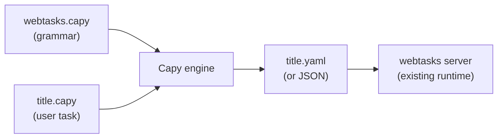

# 2. Capy primer

This chapter summarizes [Capy](https://github.com/olivierdevelops/capy) concepts
you need before reading the webtasks grammar proposal. Full upstream docs:
[library authoring](https://github.com/olivierdevelops/capy/blob/main/docs/library-authoring.md),
[inner DSL](https://github.com/olivierdevelops/capy/blob/main/docs/inner-dsl.md),
[types](https://github.com/olivierdevelops/capy/blob/main/docs/types.md).

---

## Mental model



Three artifacts:

1. **Library** (`webtasks.capy`) — defines what valid task source looks like
   and how each statement becomes YAML fragments + accumulated context.
2. **Source script** (`tasks/basics/title.capy`) — one task per file (convention).
3. **Output** — YAML matching today's schema (Phase 1).

Capy has **zero built-in user keywords**. `task`, `goto`, `extract` — all
defined by your library.

---

## Library file anatomy

```
extension yaml                    # output looks like YAML

context                           # accumulates task metadata + flow steps
    name ""
    poolTag "default"
    transports []
    timeoutMs 60000
    input {}
    flow []
end

type ActionName                   # library-defined validation
    options "goto" "wait-for" "extract" ...
end

function task                     # block: wraps entire task
    arg literal "task"
    arg capture slug string
    block_closer end
    set context.name slug
end

function goto
    arg literal "goto"
    arg capture url string
    append context.flow {run: "goto", params: {url: url}}
end

file_template                     # assemble final YAML
    write (toYAML context)
end
```

---

## Functions and matching

Each `function NAME … end` declares one **statement shape** in user source.

| Mechanism | Behavior |
|---|---|
| `arg literal "goto"` | Must match token `goto` |
| `arg capture url string` | Bind next value to `url` |
| Auto-name-prepend | Zero literals → leading token is function name |
| `block_closer end` | Indented body until `end` |
| `priority N` | Disambiguate overlapping shapes |

Example — auto-name-prepend:

```
function greet
    arg capture name string
end
```

Matches: `greet "world"` (leading `greet` injected automatically).

Example — operator style (literals own the shape):

```
function assign
    arg capture var ident
    arg literal "="
    arg capture value any
end
```

Matches: `x = 42` with no `assign` keyword.

---

## Inner DSL (function bodies)

Inside each function, statements either **emit text** or **mutate context**:

| Statement | Purpose |
|---|---|
| `write \`…\`` | Append to output fragment (often unused per-step; we use context) |
| `set context.field value` | Assign |
| `append context.flow step` | Push flow command |
| `if cond … end` | Conditional metadata |
| `for x in list … end` | Loop |
| `error "msg"` | Abort transpile with message |

Captures (`url`, `slug`, …) are read-only inside the body. Paths rooted at
`context` are mutable.

---

## Types validate captures

```capy
type PoolTag
    options "default" "concio" "colab"
end

function pool
    arg literal "pool"
    arg capture tag PoolTag
    set context.poolTag tag
end
```

Invalid: `pool production` → transpile error at author time.

Built-in capture kinds: `any`, `ident`, `string`, `int`, `float`, `bool`,
`word`, `tail`, `dotted_ident`, `raw`.

---

## Block functions

webtasks needs nested steps for `record`, `capture-network`, `for-each`, `loop`:

```capy
function record
    arg literal "record"
    arg capture dest ident
    block_closer end
    append context.flow {
        run: "record",
        as: dest,
        do: body_steps_from_nested_parse
    }
end
```

Capy provides `${body}` in block function templates — rendered output of nested
statements. For webtasks, nested statements should **append to a nested flow list**
in context rather than emit text — see [chapter 10](10-transpilation-pipeline.md).

---

## CLI essentials

```bash
go install github.com/olivierdevelops/capy/cmd/capy@latest

capy check capy/webtasks.capy          # validate library
capy run capy/webtasks.capy task.capy  # transpile to stdout
capy docs capy/webtasks.capy           # auto-generate DSL reference
```

---

## Embedding (Go)

```go
import "github.com/olivierdevelops/capy"

lib, err := capy.NewLibraryFromFile("capy/webtasks.capy")
yamlBytes, err := lib.Run(string(taskSource))
```

`NewLibrary` compiles once; `Run` is safe to call concurrently on the same
`*Library`. See [chapter 11](11-go-embedding.md).

---

Next: [YAML ↔ Capy mapping →](03-yaml-capy-mapping.md)
