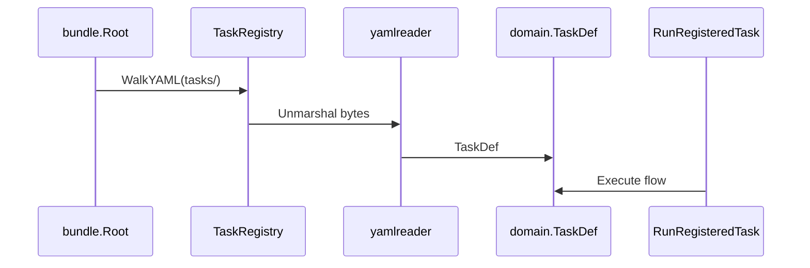
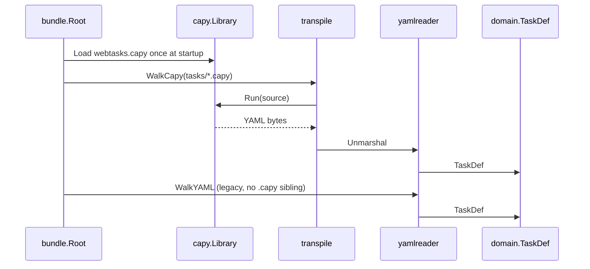

# 8. Integration architecture

Where Capy fits in webtasks' [VHCO](../architecture.md) layout.

---

## Current path (YAML only)



Hot-reload: `MakeTaskRegistry` re-walks YAML on every `Get(name)`.

---

## Proposed path (Capy + YAML)



New components (all in `infra/` + wired in `orchestrator/`):

| Component | Package | Role |
|---|---|---|
| `CapyTranspiler` | `infra/capyx` | Wrap `capy.NewLibraryFromFile`, cache `*Library` |
| `WalkCapy` | `infra/bundle` | Like `WalkYAML` but for `*.capy` |
| `MakeTaskRegistry` | `orchestrator/features` | Orchestrate both walks |

---

## VHCO placement

```
internal/
├── domain/           # TaskDef unchanged
├── features/         # TaskRegistry unchanged
├── infra/
│   ├── bundle/       # + WalkCapy
│   └── capyx/        # NEW: capy embed adapter
├── orchestrator/
│   └── features/
│       └── makes.go  # MakeTaskRegistry extended
```

`infra/capyx` has **no knowledge** of VHCO protocols — raw adapter only.
Orchestrator closes over bundle path + library path.

---

## Configuration

| Env var | Default | Purpose |
|---|---|---|
| `WEBTASKS_CAPY_LIB` | `{bundle}/capy/webtasks.capy` | Grammar library path |
| `WEBTASKS_CAPY_ENABLE` | `true` when library exists | Feature flag |
| `WEBTASKS_CAPY_CACHE` | `true` | Cache transpile output by source hash |

If library missing and `.capy` files exist → startup warning + skip Capy files.
If library missing and no `.capy` files → pure YAML mode (today's behavior).

---

## Error handling

Transpile errors must surface with **source path + line**:

```
tasks/crawl/hn.capy:12: function "pool" arg "tag": value "prod" not in options for type "PoolTag"
```

Wire through HTTP `GET /tasks` as registration errors, or fail server boot —
recommend **fail boot** for deterministic deployments, **warn + skip** for dev
hot-reload (configurable).

---

## No change to execution

`RunRegisteredTaskImpl`, chromedp primitives, templating, pools — untouched.
Capy is strictly an **authoring/transpile** concern.

---

Next: [Bundle loader →](09-bundle-loader.md)
