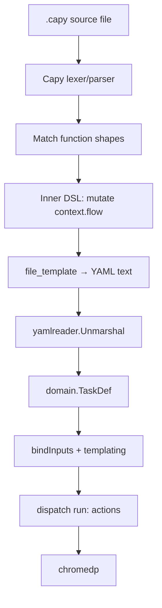

# 10. Transpilation pipeline

End-to-end data flow from `.capy` source to executing browser steps.

---

## Pipeline stages



Stages 1–5 are **new** (Capy v0.20: `Run` or `RunMulti`). Stages 6–10 are **unchanged**.

### RunMulti (optional)

When the library declares multiple `file "…"` blocks, one task script can emit:

| Output path | Contents |
|---|---|
| `tasks/crawl/hn.yaml` | TaskDef YAML |
| `scripts/demo/helper.js` | Generated or verbatim JS (rare) |

`infra/capyx.Transpile` returns `map[path]string`; the registry loader picks the `.yaml` entry.

---

## Stage detail: context accumulation

Each DSL statement appends one map to `context.flow`:

```json
{
  "run": "extract",
  "as": "stories",
  "params": {
    "selector": "tr.athing",
    "repeat": true,
    "fields": {
      "title": { "kind": "text", "selector": ".titleline > a" }
    }
  }
}
```

Block actions nest `do` as a list of child maps — built by a nested parse scope
that appends to `context._nestedFlow` then attaches to parent step.

### Nested flow pattern (library design)

```capy
function capture-network
    ...
    block_closer end
    append context.flow {
        run: "capture-network",
        as: as_name,
        do: context._nestedFlow
    }
    set context._nestedFlow []
end
```

Nested statements inside the block append to `_nestedFlow` instead of `flow`.

---

## Stage detail: YAML emission

Requirements for emitted YAML:

1. Valid UTF-8, parseable by `gopkg.in/yaml.v3`
2. `name` matches `task "…"` slug
3. All `run:` values exist in engine dispatch table
4. Numeric fields (`timeoutMs`) are integers not strings

Golden tests: store `tasks/foo.golden.yaml` next to `foo.capy`.

---

## Alternative: JSON hop (Phase 2)

Skip YAML text entirely:

```go
yamlBytes, _ := lib.Run(src)
var d domain.TaskDef
_ = yaml.Unmarshal(yamlBytes, &d)
// Phase 2:
jsonBytes, _ := lib.RunJSON(src)  // file_template extension: json
_ = json.Unmarshal(jsonBytes, &d)
```

Or custom `file_template` emitting JSON matching `TaskDef` struct tags directly.

Benefit: no YAML quoting edge cases. Cost: harder to hand-inspect transpile output.

---

## CLI dev loop (before Go integration)

Authors transpile locally:

```bash
capy run capy/webtasks.capy tasks/basics/title.capy | tee /tmp/title.yaml
WEBTASKS_BUNDLE=/tmp/manual-bundle ./build/webtasks   # bundle with generated yaml
```

Fast iteration without rebuilding Go.

---

## Observability

Log at debug level:

```
[capy] transpiled tasks/crawl/hn.capy → 847 bytes YAML (2.1ms)
```

On error, log full capy stack with caret (Capy native format).

Optional: `GET /tasks/_debug/transpile/<name>` returns generated YAML (dev only).

---

Next: [Go embedding →](11-go-embedding.md)
