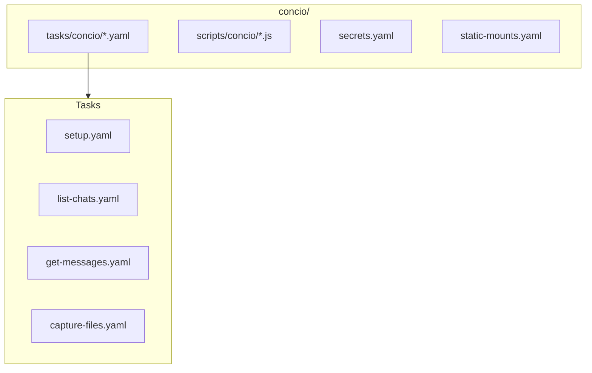
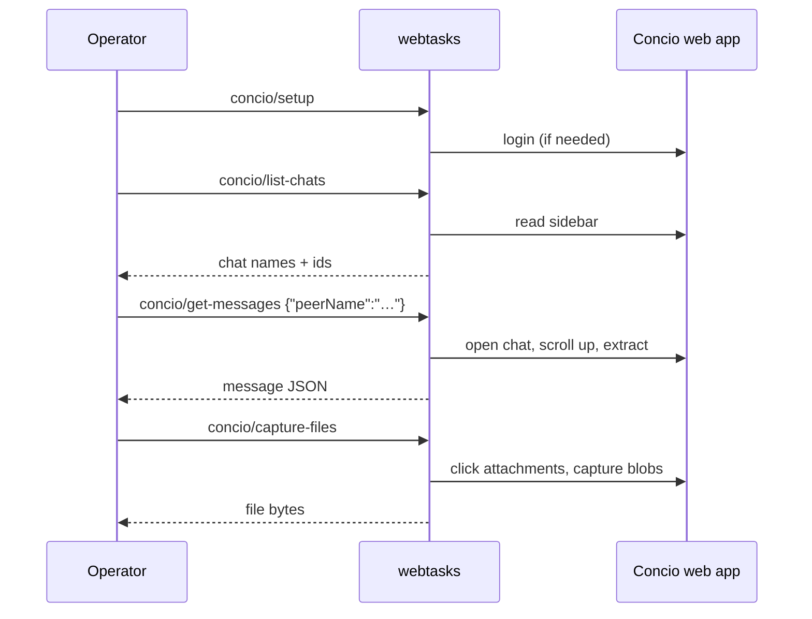

# Real-world: Concio bundle

A production-grade config bundle for scraping a logged-in
[Concio (Starise IM)](https://starise.com/) account — demonstrates secrets,
persistent sessions, JS modules, blob capture, and multi-task orchestration.

The Concio bundle lives separately from `demo/` at [`concio/`](https://github.com/olivierdevelops/webtasks/tree/main/concio).

---

## What it produces

```
<owner>/
├── chats/<YYYY>/<MM>/<DD>/
│   └── chat_<owner>_<peer>_<ts>_<mo|mt>_<msgIdHi>_<msgIdLo>.json
├── files/                       # decrypted attachment bytes
└── users_mapping.json
groups_mapping.json
```

Designed for consumption by rag-ingestion / message-reader pipelines.

---

## Bundle layout



| File | Purpose |
|---|---|
| `tasks/concio/setup.yaml` | Idempotent login |
| `tasks/concio/list-chats.yaml` | Sidebar chat list |
| `tasks/concio/list-contacts.yaml` | Contacts directory |
| `tasks/concio/list-groups.yaml` | Groups directory |
| `tasks/concio/get-messages.yaml` | Open chat + scroll + extract |
| `tasks/concio/capture-files.yaml` | Encrypted attachment capture |
| `scripts/concio/login.js` | Form fill with `{{CONCIO_PASSWORD}}` |
| `scripts/concio/install-download-hook.js` | Blob capture patch |
| `secrets.yaml` | Declares `CONCIO_PASSWORD` |

---

## Run it

```bash
# 1. Start with the concio bundle
WEBTASKS_BUNDLE=$(pwd)/concio ./build/webtasks &
# Resolve CONCIO_PASSWORD via env, --flag, or prompt (see secrets.yaml)

# 2. Log in (idempotent)
executor call concio/setup

# 3. Explore
executor call concio/list-chats
executor call concio/list-contacts

# 4. Pull one chat's messages
executor call concio/get-messages '{"peerName":"Alice"}'
```

Or use the all-in-one helper:

```bash
executor concio-extract
```

---

## Key patterns demonstrated

### Declared secrets

```yaml
# concio/secrets.yaml
secrets:
  - name: CONCIO_PASSWORD
    description: "Concio account password"
    required: true
    sensitive: true
    sources: ["env", "arg", "prompt"]
```

Used in JS as `{{CONCIO_PASSWORD}}` after resolution at startup.

→ [Secrets reference](../secrets.md)

### Persistent login profile

The `concio` pool uses a persistent Chrome profile so login survives restarts:

```yaml
# concio/tasks/pool.yaml
pools:
  concio: { size: 1, persistent: true }
```

→ [Pools reference](../pools.md)

### Blob download hook

Apps that decrypt client-side before download can't use normal click-and-poll.
The bundle patches `URL.createObjectURL` to capture blobs:

```js
// scripts/concio/install-download-hook.js (conceptual)
// Intercepts blob URLs and posts captured bytes back to webtasks
```

→ [Cookbook §7](../cookbook.md#7-trigger-downloads-and-capture-the-bytes)

### Scroll-to-load history

```yaml
- run: scroll-until-stable
  params:
    selector: ".chat-panel"
    direction: up
    stableMs: 1000
    maxIterations: 50
```

Same primitive as [Interaction → scroll-feed](interaction.md).

### Static mounts for captured files

```yaml
# concio/static-mounts.yaml
mounts:
  - prefix: /files
    path: "${CONCIO_OUTPUT_DIR}/files"
```

Serve captured attachments over HTTP for downstream processing.

→ [Static mounts](../static-mounts.md)

---

## Task chain



---

## When to copy this pattern

Use the Concio bundle as a template when your target:

- Requires login (persistent profile + setup task)
- Uses client-side encryption before download (blob hook)
- Has infinite-scroll history (scroll-until-stable)
- Needs multiple coordinated tasks (`call` chains)

---

## What's next?

- [Secrets](../secrets.md) — declare and resolve credentials
- [Pools](../pools.md) — persistent profiles and concurrency
- [Build your own task](../build-your-own-task.md) — start from scratch
