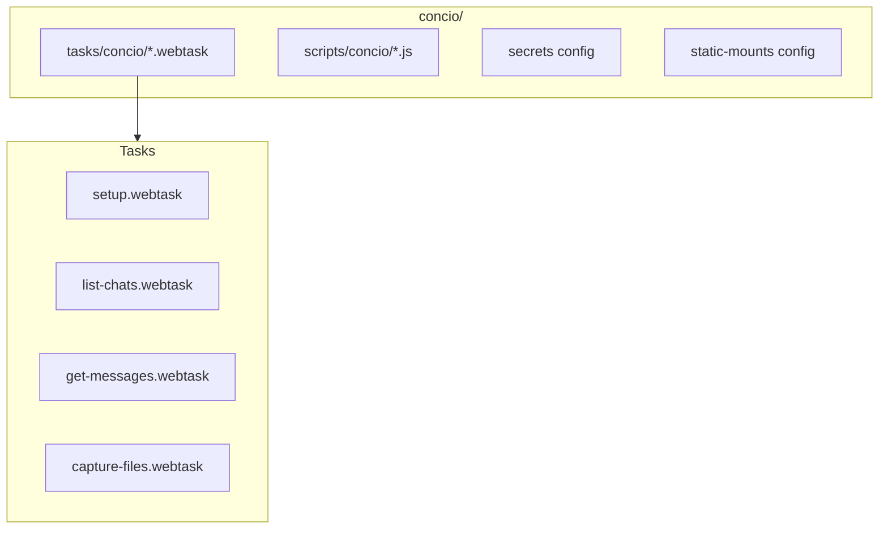
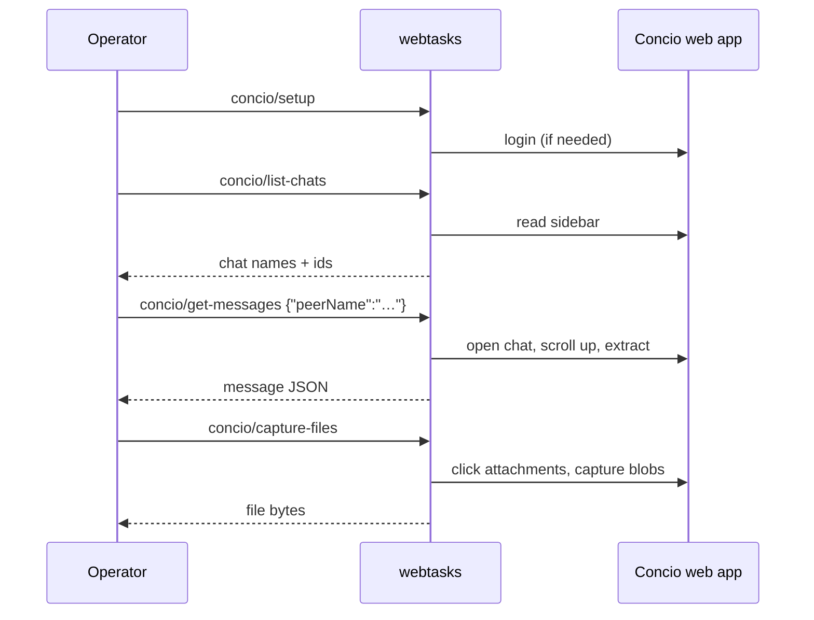

# Real-world: Concio bundle

A production-grade config bundle for scraping a logged-in
[Concio (Starise IM)](https://starise.com/) account — demonstrates secrets,
persistent sessions, JS modules, blob capture, and multi-task orchestration.

The Concio bundle lives separately from `demo/` at [`concio/`](https://github.com/olivierdevelops/webtasks/tree/main/concio).

---

## What it produces

```
<owner>/
├── chats/<YYYY>/<MM>/<DD>/
│   └── chat_<owner>_<peer>_<ts>_<mo|mt>_<msgIdHi>_<msgIdLo>.json
├── files/                       # decrypted attachment bytes
└── users_mapping.json
groups_mapping.json
```

Designed for consumption by rag-ingestion / message-reader pipelines.

---

## Bundle layout



| File | Purpose |
|---|---|
| `tasks/concio/setup.webtask` | Idempotent login |
| `tasks/concio/list-chats.webtask` | Sidebar chat list |
| `tasks/concio/list-contacts.webtask` | Contacts directory |
| `tasks/concio/list-groups.webtask` | Groups directory |
| `tasks/concio/get-messages.webtask` | Open chat + scroll + extract |
| `tasks/concio/capture-files.webtask` | Encrypted attachment capture |
| `scripts/concio/login.js` | Form fill with `{{CONCIO_PASSWORD}}` |
| `scripts/concio/install-download-hook.js` | Blob capture patch |
| secrets config | Declares `CONCIO_PASSWORD` |

---

## Run it

```bash
# 1. Start with the concio bundle
WEBTASKS_BUNDLE=$(pwd)/concio webtasks &
# Resolve CONCIO_PASSWORD via env, --flag, or prompt (see the secrets config)

# 2. Log in (idempotent)
curl -s -X POST localhost:8765/tasks/concio/setup -d '{}'

# 3. Explore
curl -s -X POST localhost:8765/tasks/concio/list-chats -d '{}'
curl -s -X POST localhost:8765/tasks/concio/list-contacts -d '{}'

# 4. Pull one chat's messages
curl -s -X POST localhost:8765/tasks/concio/get-messages -d '{"peerName":"Alice"}'
```

Or stream the full server-side sweep over every chat:

```bash
curl -N -X POST localhost:8765/tasks/concio/extract-all \
  -H 'Accept: text/event-stream' -d '{"out":".ignore/data"}'
```

---

## Key patterns demonstrated

### Declared secrets

The bundle declares one **required, sensitive** secret — `CONCIO_PASSWORD` —
resolved at startup from the environment, a launcher flag, or an interactive
prompt. Tasks then reference it as `{{CONCIO_PASSWORD}}`; no `input` entry is
needed.

→ [Secrets reference](../deploy.md#secrets)

### Persistent login profile

The `concio` pool is `size 1` and **persistent**, so the Chrome profile (and
therefore the login) survives server restarts:

```capy
sendkeys "#password" keys "{{CONCIO_PASSWORD}}"
```

→ [Persistent profiles](../deploy.md#persistent-profiles)

### Blob download hook

Apps that decrypt client-side before download can't use normal click-and-poll.
The bundle patches `URL.createObjectURL` to capture blobs:

```js
// scripts/concio/install-download-hook.js (conceptual)
// Intercepts blob URLs and posts captured bytes back to webtasks
```

→ [Cookbook](../cookbook.md)

### Scroll-to-load history

```capy
scroll until stable ".chat-panel" direction up stable 1000 max 50
```

Same primitive as [Interaction → scroll-feed](interaction.md).

### Static mounts for captured files

A `/files` mount points at the capture output directory so attachments are
fetchable over HTTP for downstream processing.

→ [Static mounts](../deploy.md#static-file-mounts)

---

## Task chain



---

## When to copy this pattern

Use the Concio bundle as a template when your target:

- Requires login (persistent profile + setup task)
- Uses client-side encryption before download (blob hook)
- Has infinite-scroll history (scroll-until-stable)
- Needs multiple coordinated tasks (`call` chains)

---

## What's next?

- [Secrets](../deploy.md#secrets) — declare and resolve credentials
- [Pools & sessions](../deploy.md#window-pools-sessions) — persistent profiles and concurrency
- [Writing tasks](../writing-tasks.md) — start from scratch
