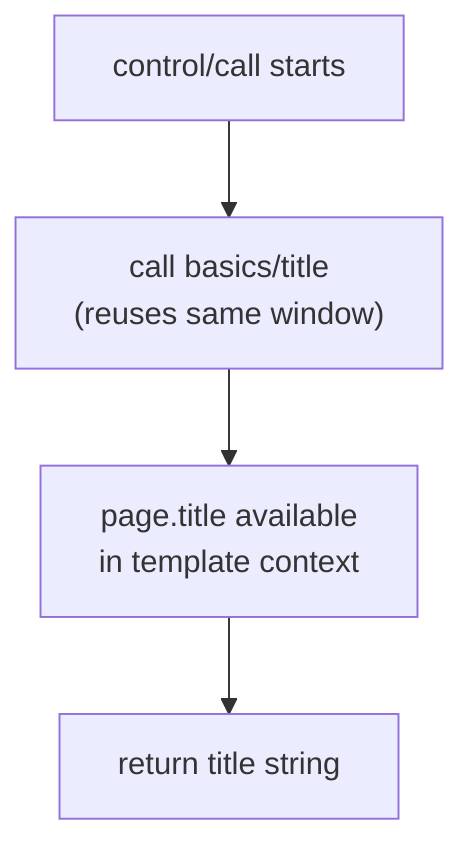

# Control flow demos

Five tasks demonstrating task composition, loops, JS conditions, and nested
recording.

---

## call

Run another task's flow inside the current window, then use its results.

```bash
curl -s -X POST localhost:8765/tasks/control/call -d '{}'
```

=== "Recipe (.webtask)"

    ```capy
    task "control/call"
        pool default
        transport rest

        call "basics/title"
        return "{{page.title}}"
    end
    ```



**Concepts:** `call` action, task reuse, template context from called task.

Build libraries of small tasks and compose them — the Concio bundle uses
this heavily (`setup` → `list-chats` → `get-messages`).

---

## loop

Repeat steps while a condition holds — iterate over pages, retry on failure.

```bash
curl -s -X POST localhost:8765/tasks/control/loop -d '{}'
```

=== "Pattern"

    ```capy
    loop max 10 while js "return document.querySelector('.next-page') !== null"
        extract page_items from ".item" repeat
            title text ".title"
        end
        click ".next-page"
    end
    ```

**Concepts:** `loop` with a `while` condition and a body, pagination.

See also [Crawl → quotes-paginated](crawl.md#quotes-paginated).

---

## loop-fn

Same as `loop` but the condition comes from a JS module.

```bash
curl -s -X POST localhost:8765/tasks/control/loop-fn -d '{}'
```

**Concepts:** `fn` modules in loop conditions, cleaner complex logic.

---

## await-js

Block until a JavaScript expression returns true.

```bash
curl -s -X POST localhost:8765/tasks/control/await-js -d '{}'
```

=== "Use case"

    ```capy
    await js "return document.querySelector('.loaded') !== null" timeout 30000 poll 500
    ```

**Concepts:** waiting for JS-driven UI state, SPAs, lazy widgets.

---

## record-step

Record a GIF of a single step (not the whole flow).

```bash
curl -s -X POST localhost:8765/tasks/control/record-step -d '{}'
```

**Concepts:** combining [Recording](recording.md) with granular step control.

---

## Control flow cheat sheet

| Action | Purpose |
|---|---|
| `call` | Run another task inline |
| `loop` | Repeat while condition true |
| `await-js` | Poll until JS returns true |
| `set` | Bind a variable |
| `return` | Early exit with value |
| `for-each` | Iterate over an array |

Full reference: [Actions](../actions.md)

---

## What's next?

- [Recording](recording.md) — visual capture of flows
- [Concio](concio.md) — production task chains
