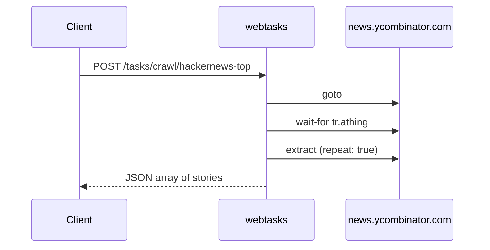

# Crawl & scrape demos

Five tasks that extract structured lists from live websites — the patterns
you'll use for most scraping workloads.

---

## hackernews-top

Front-page Hacker News: rank, title, URL, and site for every story.

```bash
executor call crawl/hackernews-top
```

=== "Task YAML"

    ```yaml
    name: "crawl/hackernews-top"
    poolTag: "default"
    transports: ["rest"]
    timeoutMs: 20000

    flow:
      - run: goto
        params: { url: "https://news.ycombinator.com" }

      - run: wait-for
        params: { selector: "tr.athing", timeoutMs: 10000 }

      - run: extract
        as: stories
        params:
          selector: "tr.athing"
          repeat: true
          fields:
            rank:  { kind: text, selector: ".rank",        transform: trim }
            title: { kind: text, selector: ".titleline > a" }
            url:   { kind: attr, selector: ".titleline > a", name: "href" }
            site:  { kind: text, selector: ".sitestr" }
    ```

=== "Response shape"

    ```json
    {
      "ok": true,
      "data": {
        "stories": [
          { "rank": "1.", "title": "…", "url": "https://…", "site": "…" },
          …
        ]
      }
    }
    ```



**Concepts:** `extract` with `repeat: true`, CSS selectors, `kind: attr`.

---

## github-trending

Trending repositories with language and time-period inputs.

```bash
executor call crawl/github-trending
executor call crawl/github-trending '{"language":"go","since":"weekly"}'
```

=== "Input schema"

    ```yaml
    input:
      language: { type: string, required: false, default: "" }
      since:    { type: string, required: false, default: "daily" }
    ```

=== "Templated URL"

    ```yaml
    - run: goto
      params: { url: "https://github.com/trending/{{language}}?since={{since}}" }
    ```

Extracts: slug, href, description, language, stars, forks.

**Concepts:** optional inputs with defaults, URL path templating.

---

## wikipedia-toc

Wikipedia table of contents — mixes single-object and repeated extraction
in one task.

```bash
executor call crawl/wikipedia-toc
```

**Concepts:** `repeat: false` for one record, `repeat: true` for a list in the
same flow.

---

## trending-papers

The canonical smoke test — 100 trending papers from Hugging Face.

```bash
executor call crawl/trending-papers
```

This is the same task shipped in `bundle-example/` as `examples/trending-papers`.
Use it to verify a fresh deployment:

```bash
curl -s http://127.0.0.1:8765/health
executor call crawl/trending-papers
# expect ~100 papers with title + href
```

**Concepts:** production smoke test, complex selector lists.

---

## quotes-paginated

Multi-page scraping pattern against quotes.toscrape.com.

```bash
executor call crawl/quotes-paginated
```

**Concepts:** pagination loops, following "next" links — a pattern you'll
adapt for any paginated site.

See [Control flow → loop](control.md#loop) for looping constructs.

---

## Selector tips

| Goal | Pattern |
|---|---|
| All table rows | `tr.athing`, `article.row` |
| Field inside row | `.titleline > a` |
| Attribute | `kind: attr`, `name: href` |
| Trim whitespace | `transform: trim` |

Full guide: [Build your own task §1](../build-your-own-task.md#1-find-your-selectors-in-devtools)

---

## What's next?

- [Search demos](search.md) — caller-driven queries
- [Interaction demos](interaction.md) — forms and scrolling
