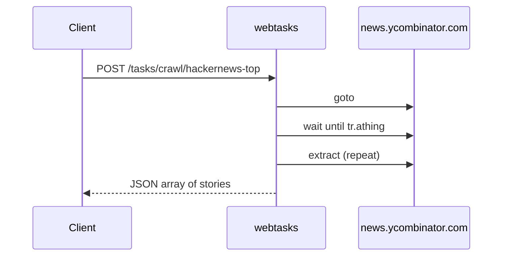

# Crawl & scrape demos

Five tasks that extract structured lists from live websites — the patterns
you'll use for most scraping workloads.

---

## hackernews-top

Front-page Hacker News: rank, title, URL, and site for every story.

```bash
curl -s -X POST localhost:8765/tasks/crawl/hackernews-top -d '{}'
```

=== "Recipe (.webtask)"

    ```capy
    task "crawl/hackernews-top"
        pool default
        timeout 20000
        transport rest

        goto "https://news.ycombinator.com"
        wait until "tr.athing" timeout 10000

        extract stories from "tr.athing" repeat
            rank  text ".rank" trim
            title text ".titleline > a"
            url   attr href on ".titleline > a"
            site  text ".sitestr"
        end
    end
    ```

=== "Response shape"

    ```json
    {
      "ok": true,
      "data": {
        "stories": [
          { "rank": "1.", "title": "…", "url": "https://…", "site": "…" }
        ]
      }
    }
    ```



**Concepts:** `extract … repeat`, CSS selectors, `attr` fields.

---

## github-trending

Trending repositories with language and time-period inputs.

```bash
curl -s -X POST localhost:8765/tasks/crawl/github-trending -d '{}'
curl -s -X POST localhost:8765/tasks/crawl/github-trending -d '{"language":"go","since":"weekly"}'
```

=== "Recipe (.webtask)"

    ```capy
    task "crawl/github-trending"
        pool default
        timeout 20000
        transport rest
        input language string default ""
        input since    string default "daily"

        goto "https://github.com/trending/{{language}}?since={{since}}"
        wait until "article.Box-row" timeout 15000
        extract repos from "article.Box-row" repeat
            slug text "h2 a"
            href attr href on "h2 a"
            desc text "p"
            stars text "a[href$='/stargazers']" trim
        end
    end
    ```

**Concepts:** optional inputs with defaults, URL path templating.

---

## wikipedia-toc

Wikipedia table of contents — mixes single-object and repeated extraction
in one task.

```bash
curl -s -X POST localhost:8765/tasks/crawl/wikipedia-toc -d '{}'
```

**Concepts:** one `extract` for a single record, another with `repeat` for a list
in the same flow.

---

## trending-papers

The canonical smoke test — 100 trending papers from Hugging Face. Use it to
verify a fresh deployment.

```bash
curl -s http://127.0.0.1:8765/health
curl -s -X POST localhost:8765/tasks/crawl/trending-papers -d '{}'
# expect ~100 papers with title + href
```

**Concepts:** production smoke test, complex selector lists.

---

## quotes-paginated

Multi-page scraping against quotes.toscrape.com — follow "next" links until
there are none.

```bash
curl -s -X POST localhost:8765/tasks/crawl/quotes-paginated -d '{}'
```

**Concepts:** pagination loops, following links — a pattern you'll adapt for any
paginated site. See [Control flow → loop](control.md#loop).

---

## Selector tips

| Goal | Pattern |
|---|---|
| All table rows | `tr.athing`, `article.row` |
| Field inside a row | `.titleline > a` |
| Attribute | `attr href on ".titleline > a"` |
| Trim whitespace | add `trim` after the field |

Full guide: [Writing tasks](../writing-tasks.md).

---

## What's next?

- [Search demos](search.md) — caller-driven queries
- [Interaction demos](interaction.md) — forms and scrolling
