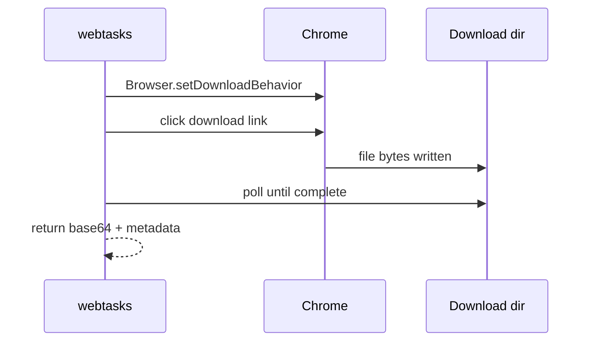

# Downloads demo

Native browser download capture — click a link and poll for the file bytes.

---

## grab-image

Click a download link and capture the PNG bytes.

```bash
executor call downloads/grab-image
```

=== "Flow pattern"

    ```yaml
    flow:
      - run: goto
        params: { url: "https://example.com/page-with-download" }
      - run: download-each
        as: files
        params:
          selector: "a.download-link"
          timeoutMs: 30000
    ```

**Concepts:** `download-each`, native CDP download behavior (no WebDriver hacks).



---

## Download strategies

webtasks supports two download paths:

| Method | When to use |
|---|---|
| **`download-each`** | Normal `<a download>` or Content-Disposition links |
| **Blob hook (`js`)** | Apps that decrypt client-side before download (see Concio) |

The Concio bundle uses a `URL.createObjectURL` patch to capture encrypted
blobs — see [Concio → capture-files](concio.md).

---

## Configuration

Downloads land in `WEBTASKS_DOWNLOADS_DIR` (default: system temp). Each
window gets an isolated subdirectory.

---

## What's next?

- [Rendering](rendering.md) — PDF and screenshot capture
- [Static mounts](../static-mounts.md) — serve captured files over HTTP
