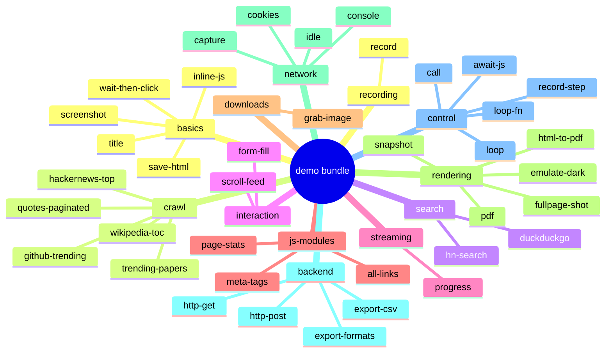

# Demo catalogue

The [`demo/`](https://github.com/olivierdevelops/webtasks/tree/main/demo) bundle
contains **38 runnable tasks** across 11 categories. Each task is a self-contained
YAML file you can read in under a minute.

---

## Run all demos

```bash
# Start the server with the demo bundle
WEBTASKS_BUNDLE=$(pwd)/demo ./build/webtasks &

# List everything
curl -s http://127.0.0.1:8765/tasks | python3 -m json.tool

# Run any task by name
curl -s -X POST http://127.0.0.1:8765/tasks/basics/title \
  -H 'Content-Type: application/json' -d '{}'
```

With the `executor` helper:

```bash
executor server &          # defaults WEBTASKS_BUNDLE to ./demo
executor list-tasks
executor call basics/title
executor call crawl/hackernews-top
executor call streaming/progress '{}' true   # SSE stream
```

---

## Category index



| Category | Tasks | Page |
|---|---|---|
| **basics/** | 5 | [Basics](basics.md) |
| **crawl/** | 5 | [Crawl & scrape](crawl.md) |
| **search/** | 2 | [Search](search.md) |
| **interaction/** | 2 | [Interaction](interaction.md) |
| **streaming/** | 1 | [Streaming (SSE)](streaming.md) |
| **js-modules/** | 3 | [JS modules](js-modules.md) |
| **downloads/** | 1 | [Downloads](downloads.md) |
| **rendering/** | 5 | [Rendering](rendering.md) |
| **network/** | 4 | [Network](network.md) |
| **backend/** | 4 | [Backend & export](backend.md) |
| **control/** | 5 | [Control flow](control.md) |
| **recording/** | 1 | [Recording](recording.md) |
| **concio/** (separate bundle) | 10+ | [Real-world Concio](concio.md) |

---

## Suggested learning path

Follow this order if you're new to webtasks:

1. **[Basics → title](basics.md#title)** — smallest possible task
2. **[Basics → screenshot](basics.md#screenshot)** — capture a PNG
3. **[Crawl → hackernews-top](crawl.md#hackernews-top)** — list extraction
4. **[Search → duckduckgo](search.md#duckduckgo)** — input templating
5. **[Interaction → form-fill](interaction.md#form-fill)** — typing and clicking
6. **[Streaming → progress](streaming.md)** — live SSE events
7. **[Control → call](control.md#call)** — compose tasks
8. **[Recording → record](recording.md)** — GIF screencast

---

## Hot-reload

The server reloads YAML from the bundle on **every request**. Edit any file
under `demo/tasks/`, then immediately re-run — no restart needed.

The demo pool is configured for **3 concurrent windows** so several tasks can
run in parallel:

```yaml
# demo/tasks/pool.yaml
pools:
  default: { size: 3 }
```

---

## Add your own demo

```bash
cp demo/tasks/basics/title.yaml demo/tasks/basics/my-task.yaml
# edit name + flow
executor call basics/my-task
```

Action vocabulary: [Actions reference](../actions.md) ·
[Cookbook](../cookbook.md)
