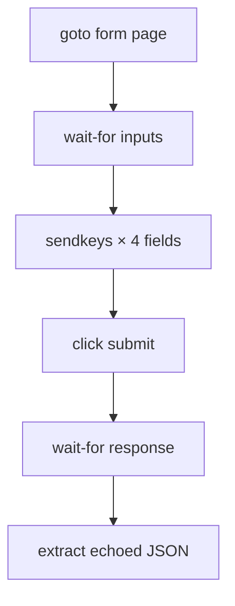

# Interaction demos

Tasks that interact with pages — filling forms, clicking buttons, and scrolling
infinite feeds.

---

## form-fill

Fill the httpbin.org POST form and return what the server echoed back.

```bash
executor call interaction/form-fill
executor call interaction/form-fill '{"custname":"Ada","custtel":"555","custemail":"a@b","comments":"hi"}'
```

=== "Task YAML (abbreviated)"

    ```yaml
    input:
      custname:  { type: string, required: false, default: "Ada Lovelace" }
      custtel:   { type: string, required: false, default: "555-0100" }
      custemail: { type: string, required: false, default: "ada@example.com" }
      comments:  { type: string, required: false, default: "hi from webtasks" }

    flow:
      - run: goto
        params: { url: "https://httpbin.org/forms/post" }
      - run: wait-for
        params: { selector: "form input[name='custname']", timeoutMs: 10000 }
      - run: sendkeys
        params: { selector: "input[name='custname']",  keys: "{{custname}}" }
      - run: sendkeys
        params: { selector: "input[name='custtel']",   keys: "{{custtel}}" }
      - run: sendkeys
        params: { selector: "input[name='custemail']", keys: "{{custemail}}" }
      - run: sendkeys
        params: { selector: "textarea[name='comments']", keys: "{{comments}}" }
      - run: action
        params: { action: click, selector: "form button" }
      - run: wait-for
        params: { selector: "pre", timeoutMs: 10000 }
      - run: extract
        as: echoed
        params:
          selector: "html"
          repeat: false
          fields:
            body: { kind: text, selector: "pre" }
    ```



**Concepts:** `sendkeys`, `action(click)`, form selectors by `name=`, waiting
for navigation results.

!!! tip "Debugging selectors"
    Run with `WEBTASKS_HEADLESS=false` and watch Chrome fill the form live.

---

## scroll-feed

Scroll an infinite-scroll demo page until the DOM stabilizes.

```bash
executor call interaction/scroll-feed
```

=== "Key step"

    ```yaml
    - run: scroll-until-stable
      params:
        selector: "body"
        direction: down
        stableMs: 800
        maxIterations: 20
    ```

**Concepts:** `scroll-until-stable`, loading lazy content, chat-history patterns.

This is the same primitive used in production bundles like
[Concio → get-messages](concio.md) to load full chat history.

---

## Action reference (interaction)

| Action | Purpose |
|---|---|
| `sendkeys` | Type into an input (`selector` + `keys`) |
| `action` | `click`, `double-click`, `hover`, etc. |
| `wait-for` | Block until selector appears |
| `scroll-until-stable` | Scroll until DOM stops changing |
| `wait` | Fixed delay (`duration` in ms) |

Full list: [Actions reference](../actions.md)

---

## What's next?

- [Recording](recording.md) — capture scroll as animated GIF
- [Concio](concio.md) — scroll-to-top on a real chat app
