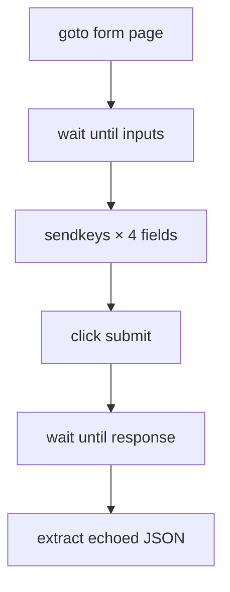

# Interaction demos

Tasks that interact with pages — filling forms, clicking buttons, and scrolling
infinite feeds.

---

## form-fill

Fill the httpbin.org POST form and return what the server echoed back.

```bash
curl -s -X POST localhost:8765/tasks/interaction/form-fill -d '{}'
curl -s -X POST localhost:8765/tasks/interaction/form-fill \
  -d '{"custname":"Ada","custtel":"555","custemail":"a@b","comments":"hi"}'
```

=== "Recipe (.webtask)"

    ```capy
    task "interaction/form-fill"
        pool default
        timeout 30000
        transport rest
        input custname  string default "Ada Lovelace"
        input custtel   string default "555-0100"
        input custemail string default "ada@example.com"
        input comments  string default "hi from webtasks"

        goto "https://httpbin.org/forms/post"
        wait until "form input[name='custname']" timeout 10000
        sendkeys "input[name='custname']"   keys "{{custname}}"
        sendkeys "input[name='custtel']"    keys "{{custtel}}"
        sendkeys "input[name='custemail']"  keys "{{custemail}}"
        sendkeys "textarea[name='comments']" keys "{{comments}}"
        click "form button"
        wait until "pre" timeout 10000
        extract echoed from "html"
            body text "pre"
        end
    end
    ```



**Concepts:** `sendkeys`, `click`, form selectors by `name=`, waiting for
results.

!!! tip "Debugging selectors"
    Run the server with `WEBTASKS_HEADLESS=false` and watch Chrome fill the form
    live.

---

## scroll-feed

Scroll an infinite-scroll page until the DOM stabilizes.

```bash
curl -s -X POST localhost:8765/tasks/interaction/scroll-feed -d '{}'
```

=== "Key step"

    ```capy
    scroll until stable "body" direction down stable 800 max 20
    ```

**Concepts:** `scroll until stable`, loading lazy content, chat-history patterns.

This is the same primitive used in production bundles like
[Concio → get-messages](concio.md) to load full chat history.

---

## Interaction actions

| Action | Purpose |
|---|---|
| `sendkeys` | Type into an input (`selector` + `keys`) |
| `click` | Click an element |
| `wait until` | Block until a selector appears |
| `scroll until stable` | Scroll until the DOM stops changing |
| `wait` | Fixed delay (milliseconds) |

Full list: [Actions reference](../actions.md).

---

## What's next?

- [Recording](recording.md) — capture scroll as an animated GIF
- [Concio](concio.md) — scroll-to-top on a real chat app
