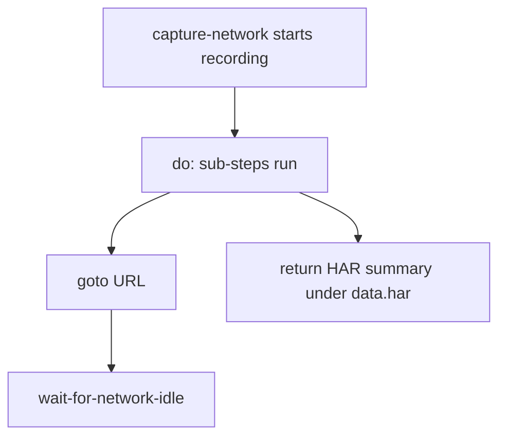

# Network demos

Four tasks for observing browser network activity, cookies, console output,
and network idle detection.

---

## capture

Record every network request while a page loads — returns a HAR-ish summary.

```bash
executor call network/capture
executor call network/capture '{"url":"https://quotes.toscrape.com"}'
```

=== "Task YAML"

    ```yaml
    flow:
      - run: capture-network
        as: har
        do:
          - run: goto
            params: { url: "{{url}}" }
          - run: wait-for-network-idle
            params: { idleMs: 800, timeoutMs: 20000 }
    ```



**Concepts:** `capture-network` wrapper with `do:` block, HAR-style output.

Use this to discover XHR endpoints before switching to [Backend → http-get](backend.md).

---

## cookies

Read and write browser cookies for the current session.

```bash
executor call network/cookies
```

**Concepts:** session persistence, cookie jar inspection, auth debugging.

Pairs with [Pools → persistent profiles](../pools.md) for login sessions that
survive restarts.

---

## console

Capture browser console log lines during a flow.

```bash
executor call network/console
```

**Concepts:** `capture-console`, debugging JS errors on target pages.

---

## idle

Wait until network activity settles — useful before extraction on SPAs.

```bash
executor call network/idle
```

=== "Key params"

    ```yaml
    - run: wait-for-network-idle
      params:
        idleMs: 800        # ms of silence required
        timeoutMs: 20000   # give up after this
    ```

**Concepts:** SPA loading patterns, when `wait-for` selector isn't enough.

---

## Debugging workflow

1. Run `network/capture` on the target URL
2. Inspect `data.har` for XHR/fetch endpoints
3. If an API is available, switch to `http-get` (no browser needed)
4. If DOM rendering is required, use `wait-for-network-idle` before `extract`

---

## What's next?

- [Backend → http-get](backend.md) — call discovered APIs directly
- [Secrets](../secrets.md) — auth tokens for authenticated requests
