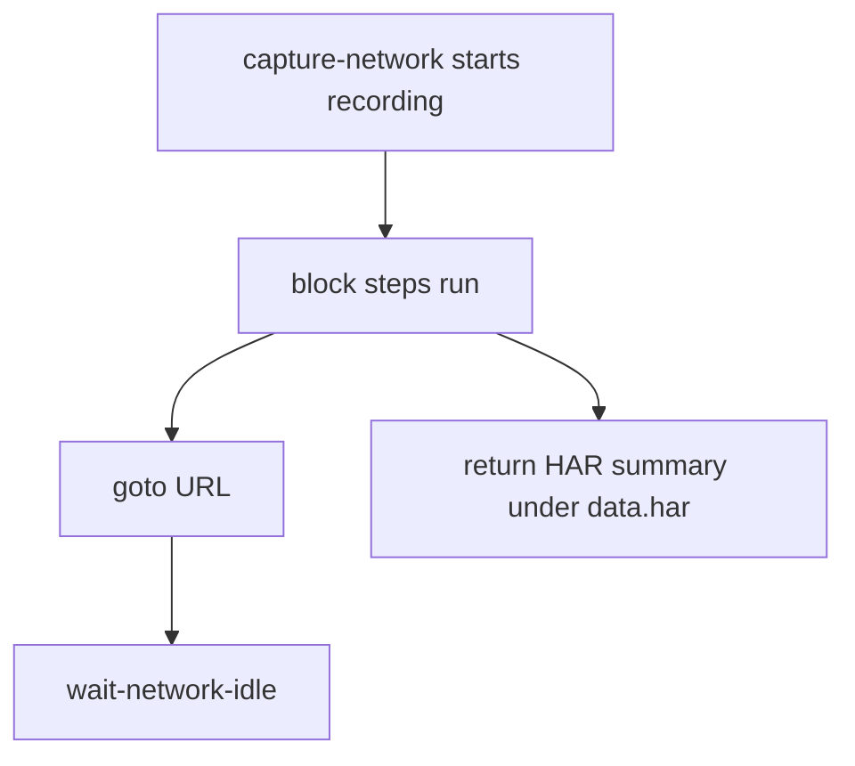

# Network demos

Four tasks for observing browser network activity, cookies, console output,
and network idle detection.

---

## capture

Record every network request while a page loads — returns a HAR-ish summary.

```bash
curl -s -X POST localhost:8765/tasks/network/capture -d '{}'
curl -s -X POST localhost:8765/tasks/network/capture -d '{"url":"https://quotes.toscrape.com"}'
```

=== "Recipe (.webtask)"

    ```capy
    capture-network har
        goto "{{url}}"
        wait-network-idle 800 timeout 20000
    end
    ```



**Concepts:** `capture-network` block, HAR-style output.

Use this to discover XHR endpoints before switching to [Backend → http-get](backend.md).

---

## cookies

Read and write browser cookies for the current session.

```bash
curl -s -X POST localhost:8765/tasks/network/cookies -d '{}'
```

**Concepts:** session persistence, cookie jar inspection, auth debugging.

Pairs with [persistent profiles](../deploy.md#persistent-profiles) for login
sessions that survive restarts.

---

## console

Capture browser console log lines during a flow.

```bash
curl -s -X POST localhost:8765/tasks/network/console -d '{}'
```

**Concepts:** `capture-console`, debugging JS errors on target pages.

---

## idle

Wait until network activity settles — useful before extraction on SPAs.

```bash
curl -s -X POST localhost:8765/tasks/network/idle -d '{}'
```

=== "Key step"

    ```capy
    wait-network-idle 800 timeout 20000
    # 800 ms of network silence required; give up after 20 s
    ```

**Concepts:** SPA loading patterns, when `wait-for` selector isn't enough.

---

## Debugging workflow

1. Run `network/capture` on the target URL
2. Inspect `data.har` for XHR/fetch endpoints
3. If an API is available, switch to `http-get` (no browser needed)
4. If DOM rendering is required, use `wait-for-network-idle` before `extract`

---

## What's next?

- [Backend → http-get](backend.md) — call discovered APIs directly
- [Secrets](../deploy.md#secrets) — auth tokens for authenticated requests
