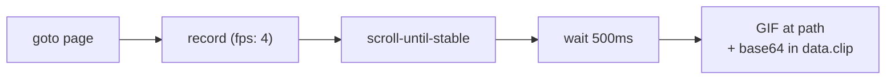

# Recording demo

Capture a browser flow as an animated GIF (or MP4 with ffmpeg).

---

## record

Navigate to a page, scroll it, and save an animated GIF of the action.

```bash
executor call recording/record
executor call recording/record '{"url":"https://quotes.toscrape.com","path":"/tmp/demo.gif"}'
```

=== "Task YAML"

    ```yaml
    name: "recording/record"
    input:
      url:    { type: string, default: "https://quotes.toscrape.com" }
      path:   { type: string, default: "/tmp/webtasks-demo/flow.gif" }
      format: { type: string, default: "gif", doc: "gif or mp4" }

    flow:
      - run: goto
        params: { url: "{{url}}" }
      - run: record
        as: clip
        params:
          format: "{{format}}"
          path: "{{path}}"
          fps: 4
        do:
          - run: scroll-until-stable
            params:
              selector: "body"
              direction: down
              stableMs: 800
              maxIterations: 8
          - run: wait
            params: { duration: "500" }
    ```



---

## Output formats

| Format | Requirement | Use case |
|---|---|---|
| **gif** | Pure Go (built-in) | Docs, Slack, README embeds |
| **mp4** | `ffmpeg` on PATH | Higher quality, video pipelines |

```bash
executor call recording/record '{"format":"mp4","path":"/tmp/demo.mp4"}'
```

---

## Parameters

| Param | Default | Description |
|---|---|---|
| `fps` | 4 | Frames per second |
| `path` | (required) | Server-side output path |
| `format` | `gif` | `gif` or `mp4` |
| `do:` | — | Steps to perform while recording |

The `do:` block defines what happens **during** the recording window — only
those steps appear in the animation.

---

## Single-step recording

For recording just one action, see [Control → record-step](control.md#record-step).

---

## Tips

!!! tip "Lower fps for smaller files"
    `fps: 2` is often enough for scroll demos. Use `fps: 8` for click interactions.

!!! tip "Headful recording"
    `WEBTASKS_HEADLESS=false` lets you watch what's being captured live.

---

## What's next?

- [Rendering](rendering.md) — static screenshots and PDFs
- [Streaming](streaming.md) — live progress while recording long flows
