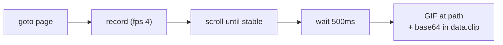

# Recording demo

Capture a browser flow as an animated GIF (or MP4 with ffmpeg).

---

## record

Navigate to a page, scroll it, and save an animated GIF of the action.

```bash
curl -s -X POST localhost:8765/tasks/recording/record -d '{}'
curl -s -X POST localhost:8765/tasks/recording/record \
  -d '{"url":"https://quotes.toscrape.com","path":"/tmp/demo.gif"}'
```

=== "Recipe (.webtask)"

    ```capy
    task "recording/record"
        pool default
        timeout 60000
        transport rest
        input url    string default "https://quotes.toscrape.com"
        input path   string default "/tmp/webtasks-demo/flow.gif"
        input format string default "gif" doc "gif or mp4"

        goto "{{url}}"
        record clip format "{{format}}" path "{{path}}" fps 4
            scroll until stable "body" direction down stable 800 max 8
            wait 500
        end
    end
    ```



---

## Output formats

| Format | Requirement | Use case |
|---|---|---|
| **gif** | Pure Go (built-in) | Docs, Slack, README embeds |
| **mp4** | `ffmpeg` on PATH | Higher quality, video pipelines |

```bash
curl -s -X POST localhost:8765/tasks/recording/record -d '{"format":"mp4","path":"/tmp/demo.mp4"}'
```

---

## Parameters

| Param | Default | Description |
|---|---|---|
| `fps` | 4 | Frames per second |
| `path` | (required) | Server-side output path |
| `format` | `gif` | `gif` or `mp4` |
| block body | — | Steps to perform while recording |

The block body defines what happens **during** the recording window — only
those steps appear in the animation.

---

## Single-step recording

For recording just one action, see [Control → record-step](control.md#record-step).

---

## Tips

!!! tip "Lower fps for smaller files"
    `fps: 2` is often enough for scroll demos. Use `fps: 8` for click interactions.

!!! tip "Headful recording"
    `WEBTASKS_HEADLESS=false` lets you watch what's being captured live.

---

## What's next?

- [Rendering](rendering.md) — static screenshots and PDFs
- [Streaming](streaming.md) — live progress while recording long flows
