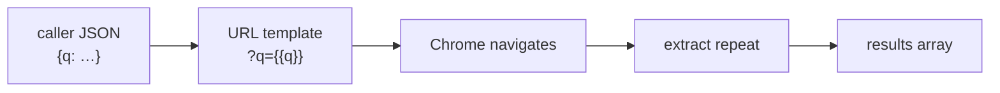

# Search demos

Two tasks showing how caller input drives URLs and how to combine browser
automation with JSON APIs.

---

## duckduckgo

Search DuckDuckGo with a query string from the caller.

```bash
curl -s -X POST localhost:8765/tasks/search/duckduckgo -d '{"q":"chromedp golang"}'
```

=== "Recipe (.webtask)"

    ```capy
    task "search/duckduckgo"
        pool default
        timeout 20000
        transport rest
        input q string required doc "Search query"

        goto "https://duckduckgo.com/?q={{q}}"
        wait until "article[data-testid='result']" timeout 10000
        extract results from "article[data-testid='result']" repeat
            title text "h2"
            link  attr href on "a"
        end
    end
    ```



**Concepts:** required inputs, URL templating, result extraction.

!!! note "URL encoding"
    Templating passes values as-is. Encode in the caller if your query has
    special characters, or use a `js` step with `encodeURIComponent()`.

---

## hn-search

Hacker News search via the Algolia JSON API — no DOM scraping for the search
itself, but uses `js` for post-processing.

```bash
curl -s -X POST localhost:8765/tasks/search/hn-search -d '{"q":"go concurrency"}'
```

The hybrid pattern:

1. `http-get` (or `goto` an API URL) for pure HTTP
2. `js` to parse and reshape the JSON
3. `return` structured results

**Concepts:** API-driven tasks, JS post-processing, when *not* to scrape the DOM.

Compare with [Backend → http-get](backend.md#http-get) for outbound HTTP without
a browser window.

---

## Pattern: input → URL → extract

Most search/scrape tasks follow this skeleton:

```capy
task "search/example"
    pool default
    transport rest
    input q string required

    goto "https://example.com/search?q={{q}}"
    wait until ".results" timeout 10000
    extract results from ".result-item" repeat
        title text ".title"
        link  attr href on "a"
    end
end
```

Copy it for any search endpoint.

---

## What's next?

- [Crawl demos](crawl.md) — fixed-URL list extraction
- [Templating reference](../templating.md) — `{{var|or:default}}` fallbacks
