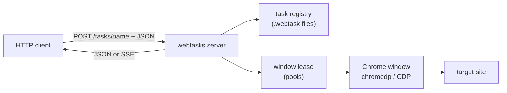
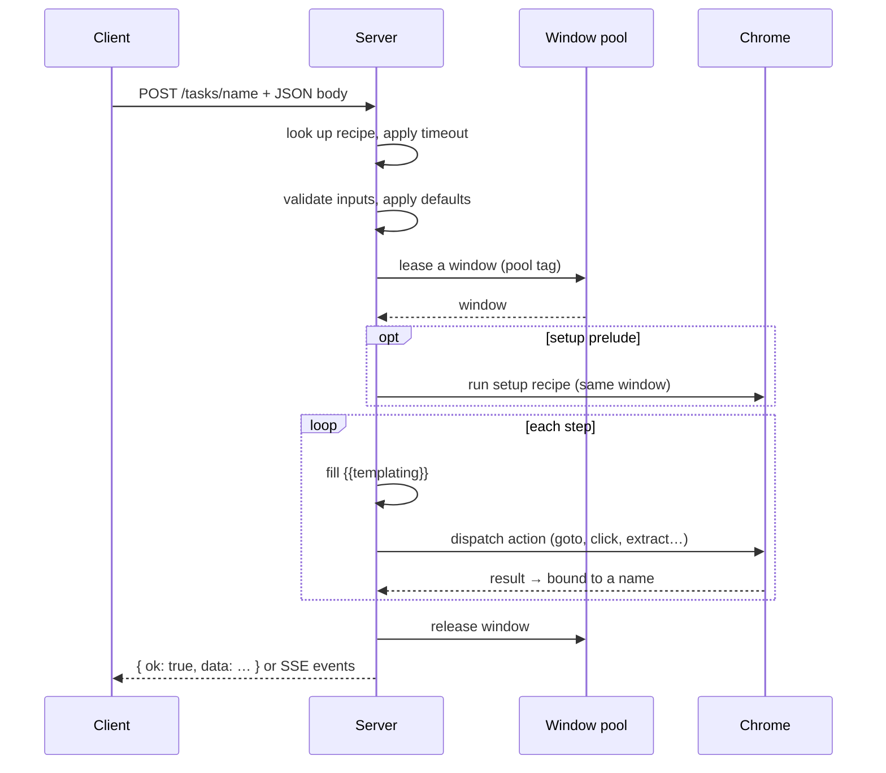
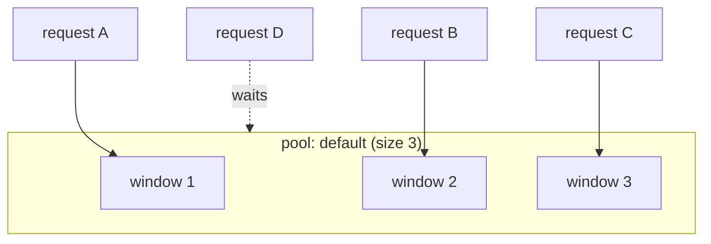
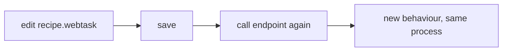

# How it works

webtasks turns a folder of `.webtask` recipes into a browser-automation API.
This page walks through the moving parts — no source code required.

---

## The big picture



Three ideas do all the work:

1. **A bundle of recipes.** Each `.webtask` file describes one flow and becomes
   one HTTP endpoint.
2. **A pool of Chrome windows.** Requests lease a window, run their steps, and
   release it — that's how concurrency and logged-in sessions are managed.
3. **A flow interpreter.** The server walks a recipe's steps top to bottom,
   dispatching each to a browser action, and returns the collected data.

---

## From recipe to endpoint

When the server starts, it reads every `.webtask` file under `tasks/` and
registers it by slug:

<div class="diagram" markdown="1">


</div>

```
tasks/crawl/hackernews-top.webtask   →   POST /tasks/crawl/hackernews-top
tasks/basics/title.webtask           →   POST /tasks/basics/title
tasks/search/duckduckgo.webtask      →   POST /tasks/search/duckduckgo
```

A recipe carries its own metadata — which pool to use, how long it may run,
which transports it supports, and what inputs callers can pass:

```capy
task "search/duckduckgo"
    pool default
    timeout 20000
    transport rest
    input q string default "chromedp" doc "Search query"

    goto "https://duckduckgo.com/?q={{q}}"
    wait until "article[data-testid='result']" timeout 12000
    extract results from "article[data-testid='result']" repeat
        title text "h2"
    end
end
```

That `input` block is the endpoint's schema: `GET /tasks` lists it, and the
`{{q}}` placeholder is filled from the request body at run time.

---

## The request lifecycle

<div class="diagram" markdown="1">


</div>

A `POST /tasks/<name>` flows through these stages:



Key behaviours:

- **Per-call deadline.** The recipe's `timeout` becomes a hard budget every
  browser call inherits. A stuck selector fails with a clear timeout instead of
  hanging a window forever.
- **Step results chain.** A step's `as`/extract name is recorded in the response
  **and** made available to later steps via `{{name}}` templating.
- **Two response modes.** Plain `POST` returns one JSON blob. Add
  `Accept: text/event-stream` and the same task streams `status` and `progress`
  events live over SSE.

---

## Window pools & concurrency



- A pool pre-allocates its Chrome windows at startup, so the first request is
  fast.
- **Parallelism per pool = its size.** A request beyond the pool size waits (up
  to 30 s) for a free window.
- A window is never shared by two runs at once — page state can't cross-talk.
- Successive runs on the *same* window keep cookies and localStorage — which is
  exactly how persistent logins and `setup` preludes work.

→ [Pools & sessions in Deployment](deploy.md#window-pools-sessions)

---

## Hot-reload

The server re-reads tasks from the bundle on **every** request. Edit a
`.webtask` file, call it again — the change is live, no restart:



JS modules under `scripts/` reload on each `js` step too. Pool sizes, secrets,
and static mounts are read once at startup.

---

## Recovering from crashes

If Chrome dies mid-run (`target detached`, `tab crashed`, …), the server
replaces the dead window with a fresh one under the same pool slot and tells the
caller the session was reset. The pool stays healthy; re-run any login/`setup`
task before retrying. With a persistent profile, the on-disk session is intact.

---

## What's next

- **[Write a task](writing-tasks.md)** — the full `.webtask` language
- **[Actions reference](actions.md)** — every step you can use
- **[Deployment](deploy.md)** — pools, secrets, packaging
- **[HTTP API](http-api.md)** — the wire contract
