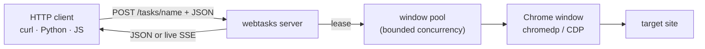

<div class="hero" markdown="1">

# Automate any browser, behind one API

**webtasks** runs Chrome on your server and turns each automation flow into a
typed HTTP endpoint. Write a short `.webtask` recipe — *go here, wait, click,
extract* — and call it with plain JSON from any language. No headless browser in
your app, no Selenium grid to babysit.

<span class="hero-stat">1 static binary</span>
<span class="hero-stat">REST + live SSE</span>
<span class="hero-stat">38 ready examples</span>
<span class="hero-stat">GPL-3.0</span>

[:octicons-rocket-24: Install in 10 seconds](install.md){ .md-button .md-button--primary }
[:octicons-play-24: See it in action](demos/index.md){ .md-button }
[:octicons-mark-github-16: Star on GitHub](https://github.com/olivierdevelops/webtasks){ .md-button }

</div>

<div class="diagram" markdown="1">


</div>

---

## The problem it solves

Browser automation usually means bolting a headless browser, a matching driver,
and brittle scripts into every service that needs it. That's heavy to run, hard
to secure, and a nightmare to keep in sync across a fleet.

webtasks flips it around: **one automation server**, called over HTTP. Selectors,
login flows, and Chrome internals live in one place. Everything else just sends
JSON and gets JSON back.

| The old way | With webtasks |
|---|---|
| A headless browser + driver in every service | One server, called over HTTP from anywhere |
| Selenium grid / chromedriver version matching | A single static binary talks to Chrome via CDP |
| Selectors & logins copy-pasted across repos | Recipes live in one bundle, reused everywhere |
| Rebuild & redeploy to change a flow | Edit a `.webtask` file — hot-reloads on next call |
| Brittle, undocumented scripts | A typed HTTP API with input/output schemas |

---

## A task is a recipe

Drop this in `tasks/crawl/hackernews-top.webtask` and it instantly becomes
`POST /tasks/crawl/hackernews-top`:

```capy
task "crawl/hackernews-top"
    pool default
    timeout 20000
    transport rest

    goto "https://news.ycombinator.com"
    wait until "tr.athing" timeout 10000

    extract stories from "tr.athing" repeat
        title text ".titleline > a"
        url   attr href on ".titleline > a"
    end
end
```

Call it from anything that speaks HTTP:

=== "curl"

    ```bash
    curl -s -X POST localhost:8765/tasks/crawl/hackernews-top -d '{}'
    ```

=== "Python"

    ```python
    import requests
    r = requests.post("http://localhost:8765/tasks/crawl/hackernews-top", json={})
    print(r.json()["data"]["stories"])
    ```

=== "JavaScript"

    ```js
    const r = await fetch("http://localhost:8765/tasks/crawl/hackernews-top", {
      method: "POST", body: "{}",
    });
    console.log((await r.json()).data.stories);
    ```

```json
{ "ok": true, "data": { "stories": [ { "title": "Show HN: …", "url": "https://…" } ] } }
```

---

## What you can build

<div class="grid cards" markdown>

- :material-table-search:{ .lg .middle } **Scrape & extract**

    ---

    Pull structured JSON from any page or list with CSS-selector field specs.
    Real sites, real data.

- :material-cursor-default-click-outline:{ .lg .middle } **Drive UIs**

    ---

    Fill forms, click, type, scroll infinite feeds, and wait for dynamic SPA
    state — with native, trusted input events.

- :material-file-pdf-box:{ .lg .middle } **Capture artifacts**

    ---

    Screenshots, full-page PDFs, MHTML archives, and animated GIF / MP4
    recordings of a whole flow.

- :material-radio-tower:{ .lg .middle } **Stream progress**

    ---

    Long jobs emit live `status` and `progress` events over Server-Sent Events
    — perfect for progress bars.

- :material-lan-connect:{ .lg .middle } **Inspect the network**

    ---

    HAR-style request capture, cookie read/write, console logs, and
    network-idle waits for flaky SPAs.

- :material-key-variant:{ .lg .middle } **Stay logged in**

    ---

    Persistent Chrome profiles + declared secrets keep authenticated sessions
    alive across restarts.

</div>

---

## Built for developers

<div class="grid cards" markdown>

- :material-language-typescript:{ .lg .middle } **Language-agnostic**

    ---

    It's just HTTP + JSON. Call tasks from Python, JS, Go, shell — anything.
    `GET /tasks` returns the input/output schema for every endpoint.

- :material-file-document-edit-outline:{ .lg .middle } **Readable recipes**

    ---

    The `.webtask` language reads like a checklist, not a config file. No
    indentation traps, no boilerplate.

- :material-reload:{ .lg .middle } **Instant feedback**

    ---

    Hot-reload re-reads recipes on every request. Edit, re-call, done — no
    restart, no rebuild.

- :material-test-tube:{ .lg .middle } **38 examples to copy**

    ---

    A demo bundle spanning scraping, forms, rendering, recording, and a
    real-world logged-in scrape.

</div>

[:octicons-arrow-right-24: Write your first task](writing-tasks.md){ .md-button }

---

## Ready for production

<div class="grid cards" markdown>

- :material-package-variant-closed:{ .lg .middle } **One binary, zero runtime deps**

    ---

    A single static binary — no JVM, no chromedriver, no Selenium server. Ship
    it plus a zipped bundle and run anywhere Chrome is installed.

- :material-server-security:{ .lg .middle } **Isolated window pools**

    ---

    Concurrency is bounded per pool; a window is never shared by two runs at
    once. Crashed tabs are detected and replaced automatically.

- :material-shield-lock-outline:{ .lg .middle } **Secrets, never inline**

    ---

    Credentials are declared in the bundle and resolved at startup from env,
    flags, or a prompt — surfaced to recipes as `{{TOKEN}}`, never hard-coded.

- :material-security:{ .lg .middle } **Hardened by default**

    ---

    Static file mounts are path-traversal–safe; per-call deadlines stop runaway
    runs; the server binds to localhost unless you opt out.

- :material-heart-pulse:{ .lg .middle } **Observable**

    ---

    `GET /health` reports live pool occupancy and task counts; SSE streams every
    step as it happens.

- :material-cloud-upload-outline:{ .lg .middle } **Portable bundles**

    ---

    Config is a directory or `.zip`, loaded at runtime. The same binary serves
    any deployment — point it at a different bundle to change behaviour.

</div>

[:octicons-arrow-right-24: Deployment guide](deploy.md){ .md-button }

---

## How a request flows



Each `.webtask` file is one endpoint. A run leases a Chrome window for its whole
duration and releases it at the end — so concurrency, sessions, and crash
recovery are all handled for you.

[:octicons-arrow-right-24: How it works in depth](how-it-works.md){ .md-button }

---

## Get started

<div class="grid cards" markdown>

- :octicons-download-24:{ .lg .middle } **[Install](install.md)**

    ---

    `curl … | sh`, start the server, run your first task in under a minute.

- :octicons-book-24:{ .lg .middle } **[Writing tasks](writing-tasks.md)**

    ---

    The complete `.webtask` language reference, with a build-from-scratch
    walkthrough.

- :octicons-beaker-24:{ .lg .middle } **[Examples](demos/index.md)**

    ---

    38 runnable recipes across 11 categories — copy, tweak, ship.

- :octicons-server-24:{ .lg .middle } **[Deployment](deploy.md)**

    ---

    Pools, secrets, static mounts, and packaging a bundle for production.

</div>

---

webtasks is free software under the **GNU General Public License v3.0**.
See [License](license.md).
