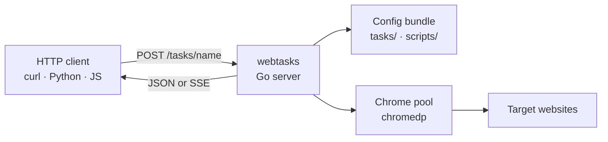

<div class="hero" markdown="1">

# webtasks

**Browser-automation as a service.** One Go binary, a folder of YAML tasks, and every task becomes a typed HTTP endpoint.

Ship selectors and Chrome internals on the server. Callers send JSON, get JSON back.

[:octicons-rocket-24: Get started](getting-started.md){ .md-button .md-button--primary }
[:octicons-play-24: Browse demos](demos/index.md){ .md-button }
[:octicons-code-24: Capy integration](capy-integration/index.md){ .md-button }
[:octicons-mark-github-16: GitHub](https://github.com/olivierdevelops/webtasks){ .md-button }

</div>

<div class="diagram" markdown="1">


</div>

## What is webtasks?

`webtasks` is a long-running **browser-automation server** built on
[chromedp](https://github.com/chromedp/chromedp) (Chrome DevTools Protocol).
You describe browser flows declaratively in YAML — `goto`, `wait-for`, `click`,
`extract`, `download-each`, and dozens more — and the server exposes each task
as `POST /tasks/<name>`.

| Traditional stack | webtasks |
|---|---|
| JVM + chromedriver matched to Chrome | Single ~17 MB Go binary |
| Config baked into the jar | Config bundle loaded at runtime (dir or zip) |
| WebDriver download hacks | Native CDP download control |
| One-off scripts | Reusable HTTP API with schemas |

<div class="feature-pills" markdown="1">

<span class="feature-pill">REST + SSE</span>
<span class="feature-pill">Hot-reload YAML</span>
<span class="feature-pill">Window pools</span>
<span class="feature-pill">PDF & screenshots</span>
<span class="feature-pill">GIF recording</span>
<span class="feature-pill">Network capture</span>
<span class="feature-pill">JS modules</span>
<span class="feature-pill">Secrets</span>

</div>

---

## 30-second quick start

```bash
# 1. Build
go build -o build/webtasks ./cmd/webtasks

# 2. Start (demo bundle included in the repo)
WEBTASKS_BUNDLE=$(pwd)/demo ./build/webtasks &

# 3. Run a task
curl -s -X POST http://127.0.0.1:8765/tasks/basics/title \
  -H 'Content-Type: application/json' -d '{}' | python3 -m json.tool
```

Expected response:

```json
{
  "ok": true,
  "data": {
    "page": {
      "title": "Example Domain",
      "heading": "Example Domain",
      "body": "This domain is for use in documentation examples …"
    }
  }
}
```

!!! tip "Using the `executor` helper"
    If you have [executor](https://github.com/olivierdevelops/webtasks/blob/main/commands.yaml) wired up locally:

    ```bash
    executor build
    executor server &
    executor call basics/title
    executor call crawl/hackernews-top
    ```

---

## How it fits together



<div class="diagram" markdown="1">


</div>

Each YAML file in `tasks/` defines one endpoint. The server **hot-reloads**
on every request — edit a task, call it again, no restart.

---

## 38 runnable demos

The [`demo/`](https://github.com/olivierdevelops/webtasks/tree/main/demo) bundle
ships **38 tasks** across 11 categories. Every demo is short enough to read
end-to-end and exercises a different engine feature.

<div class="demo-grid" markdown="1">

<div class="demo-card" markdown="1">

### [Basics](demos/basics.md)
`basics/title` · `screenshot` · `inline-js`

Minimal flows — the building blocks.

</div>

<div class="demo-card" markdown="1">

### [Crawl](demos/crawl.md)
HN · GitHub trending · Wikipedia · papers

List extraction from real sites.

</div>

<div class="demo-card" markdown="1">

### [Search](demos/search.md)
DuckDuckGo · HN Algolia API

Input-driven URLs and API calls.

</div>

<div class="demo-card" markdown="1">

### [Interaction](demos/interaction.md)
Form fill · infinite scroll

Clicks, typing, scrolling.

</div>

<div class="demo-card" markdown="1">

### [Streaming](demos/streaming.md)
`streaming/progress`

Live SSE progress events.

</div>

<div class="demo-card" markdown="1">

### [Rendering](demos/rendering.md)
PDF · screenshots · MHTML · dark mode

Capture pages as files.

</div>

<div class="demo-card" markdown="1">

### [Network](demos/network.md)
HAR capture · cookies · console

Observe browser internals.

</div>

<div class="demo-card" markdown="1">

### [Control flow](demos/control.md)
`call` · `loop` · `await-js`

Compose and branch tasks.

</div>

<div class="demo-card" markdown="1">

### [Recording](demos/recording.md)
Animated GIF / MP4 screencasts

Record flows visually.

</div>

<div class="demo-card" markdown="1">

### [Concio](demos/concio.md)
Real-world logged-in scrape

Production-grade bundle example.

</div>

</div>

[:octicons-arrow-right-24: Full demo catalogue](demos/index.md)

---

## Documentation map

| I want to… | Read |
|---|---|
| Install and run my first task | [Getting Started](getting-started.md) |
| Copy-paste working examples | [Demos](demos/index.md) |
| Author a task from scratch | [Build your own task](build-your-own-task.md) |
| Look up recipes | [Cookbook](cookbook.md) |
| See every `run:` keyword | [Actions reference](actions.md) |
| Integrate via HTTP | [HTTP API](http-api.md) |
| Deploy to production | [Bundle](bundle.md) · [Configuration](configuration.md) |
| Replace YAML with Capy DSL | [Capy integration guide](capy-integration/index.md) |
| Extend the engine | [Architecture](architecture.md) · Cookbook §12 |

---

## License

webtasks is released under the **GNU General Public License v3.0** — a
copyleft license. You may use, modify, and distribute it, but derivative
works must also be open source under GPL-compatible terms.

See [License](license.md) for details.
